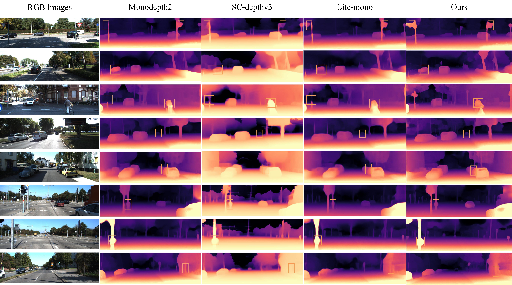

<div id="top" align="center">
  
# LSMDepth 
**Lightweight self-supervised monocular depth estimation based on hybrid attention mechanism**
  
  Jia Liu, Guorui Lu, Jiaxu Ning, Lina Wei, Dapeng Chen*
  
</div>

## Abstract
Aiming at the problems of high computational complexity and large number of parameters of the current monocular depth estimation model, we construct a lightweight self-supervised monocular depth estimation network model by combining an improved convolutional neural network with a hybrid attention mechanism. We incorporate the linear attention mechanism into the network encoder and combine the dilated convolution and deformable convolution modules to enhance the network's ability to extract multi-scale features while effectively reducing computational and memory consumption. In the jump connection part of the decoder and encoder, we incorporate the dual-channel attention mechanism, which effectively improves the fusion of low and high level features and enhances the robustness and accuracy of depth estimation. The experimental results show that the proposed method has an AbsRel of 0.102 on the KITTI dataset, the number of model parameters is only 3.0 M, and the inference speed reaches 2.8 ms. Our method significantly reduces the computational complexity while guaranteeing the high accuracy, and it has a strong real-time and practicality, which makes it suitable to be applied to the edge devices and real-time depth estimation tasks.
## Overview


## Comparison of KITTI dataset visualizations


## Comparison of KITTI dataset results 
| Model                                | Parameters (M) | AbsRel | SqRel | RMSE  | RMSElog | δ1   | δ2   | δ3   |
|--------------------------------------|----------------|--------|-------|-------|---------|-------|-------|-------|
| Zhou                                 | 34.2           | 0.208  | 1.768 | 6.958 | 0.283   | 0.678 | 0.885 | 0.957 |
| SGDepth                              | 16.3           | 0.113  | 0.835 | 4.693 | 0.191   | 0.879 | 0.961 | 0.981 |
| MonoFormer-ViT                       | 23.9           | 0.108  | 0.960 | 4.594 | 0.184   | 0.884 | 0.950 | 0.981 |
| Monodepth2                           | 32.5           | 0.115  | 0.903 | 4.863 | 0.193   | 0.877 | 0.959 | 0.981 |
| R-MSMF6                              | 3.8            | 0.120  | 1.062 | 5.800 | 0.204   | 0.857 | 0.948 | 0.978 |
| Lite-Mono                            | 3.1            | 0.107  | 0.765 | 4.461 | 0.183   | 0.886 | 0.960 | 0.979 |
| MonoViT-tiny                         | 10.3           | 0.106  | 0.749 | 4.484 | 0.183   | 0.888 | 0.961 | 0.980 |
| HR-Depth                             | 14.7           | 0.109  | 0.792 | 4.632 | 0.185   | 0.884 | 0.959 | 0.979 |
| Sc-depth3                            | 59.3           | 0.118  | 0.756 | 4.756 | 0.188   | 0.844 | 0.960 | 0.980 |
| DNA-Depth-B0                         | 9.1            | 0.130  | 1.053 | 5.144 | 0.208   | 0.853 | 0.940 | 0.979 |
| Bian                                 | 7.0            | 0.125  | 0.856 | 5.071 | 0.201   | 0.849 | 0.948 | 0.980 |
| **Ours**                             | **3.0**        | **0.102** | **0.746** | **4.543** | **0.178** | **0.896** | **0.964** | **0.983** |


## Data Preparation
Please refer to [Monodepth2](https://github.com/nianticlabs/monodepth2) to prepare your KITTI data.

## Install

The models were trained using CUDA 11.8, Python 3.9.x (conda environment), and PyTorch 2.4.1.

Create a conda environment with the PyTorch library:

```bash
conda create -n LSMDepth python=3.9.4
conda install pytorch==2.4.1 torchvision==0.19.1 torchaudio==2.4.1  pytorch-cuda=11.8 -c pytorch -c nvidia
```

Install prerequisite packages listed in requirements.txt:
```bash
pip install -r requirements.txt
```

## Training
The models can be trained on the KITTI dataset by running:
```bash
python train.py --data_path path/to/your/data --model_name mymodel
```

## Inference
To inference on a single image,run:
```bash
python test_simple.py --load_weights_folder path/to/your/weights/folder --image_path path/to/your/test/image
```
## Evaluation
To evaluate a model on KITTI, run:
```bash
python evaluate_depth.py --load_weights_folder path/to/your/weights/folder --data_path path/to/kitti_data/ --model lite-mono
```
